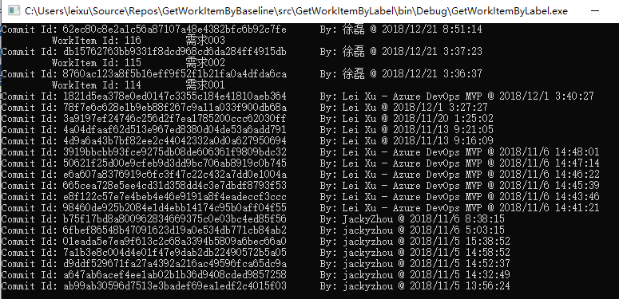
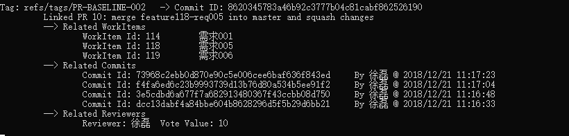

# 示例代码：通过代码基线获取所包含的需求列表

本示例代码使用Azure DevOps Rest API通过基线（tfsvc label）获取当前label所包含的所有变更集上关联过的工作项列表。

## 参考链接

* [Azure DevOps Rest API](https://docs.microsoft.com/en-us/rest/api/azure/devops/?view=azure-devops-rest-4.1)
* [API和TFS版本映射表](https://docs.microsoft.com/en-us/rest/api/azure/devops/?view=azure-devops-rest-4.1#api-and-tfs-version-mapping)
* [Rest API nuget Package](https://docs.microsoft.com/en-us/azure/devops/integrate/concepts/dotnet-client-libraries?view=vsts)

## 运行方式

在代码中填写 TFS URL 和 PAT 直接运行接口

运行效果如下

### 1. TFVC 从Label获取ChangeSet并找到相关工作项

基线(Label)和变更集(changeset)以及工作项关系如下

### 2. Git 从2个Tags之间的差异的commit找到相关的工作项

### 3. Git 从2个Tags之间的差异的pull request找到相关的工作项

